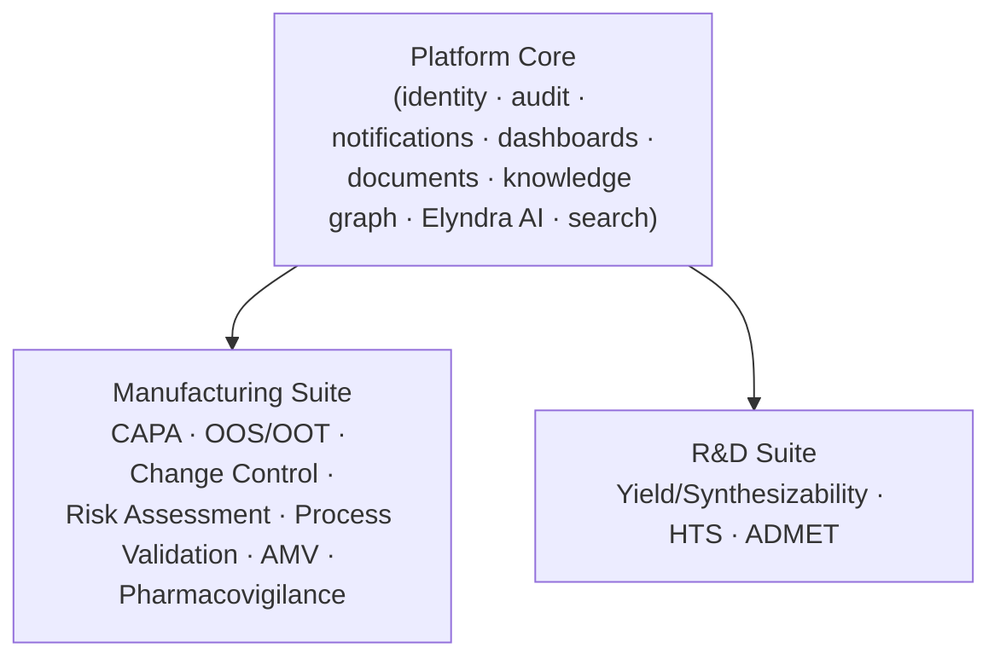
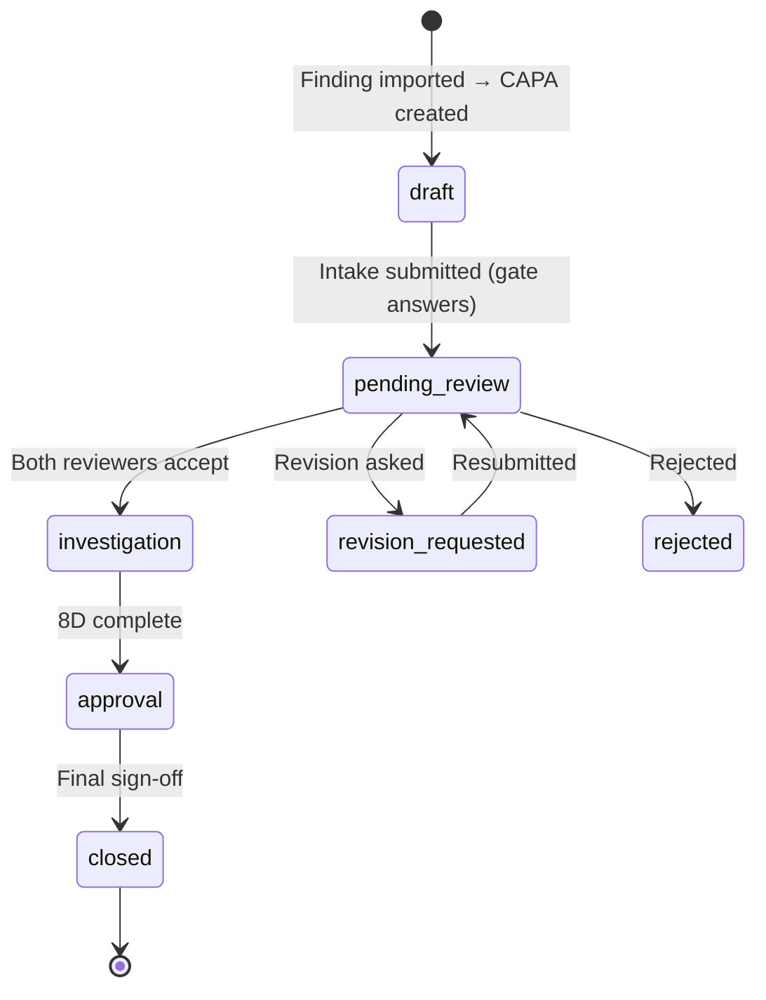
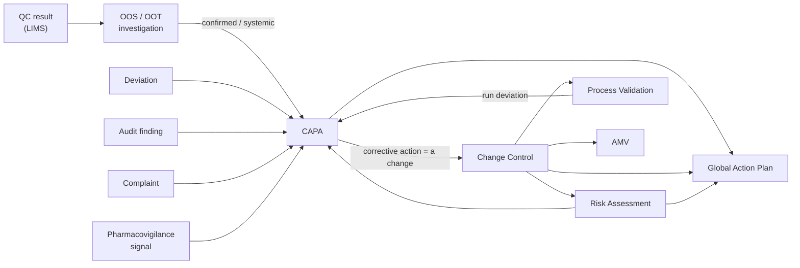
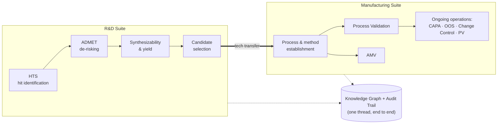
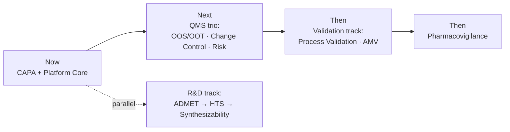

# Lead AI — Product Specification

> **Product:** **Lead AI** — an AI-native pharmaceutical quality & discovery platform. The embedded AI assistant is branded **Elyndra**.
>
> **Status:** Forward-looking planning document. This is the *target* product, not an as-built description. Today, exactly one module — **CAPA** — is fully built and serves as the proven reference for everything else.
>
> **Companion:** [`TECHNICAL_SPEC.md`](TECHNICAL_SPEC.md) covers the *how* (architecture, data model, engines). This document covers the *what & why*.

## How to use this document

This is a **living planning anchor**. Its purpose is to hold a clear, shared picture of where the whole product is headed so that any future discussion — with a teammate or with an AI assistant — can start from the same context instead of being re-derived each time.

- Read sections **2–7** for the product thesis, market, and the platform/module split.
- Read section **8** (CAPA) to understand the concrete, working reference every other module is modelled on.
- Read section **9** for one-page blueprints of the nine not-yet-built modules.
- Section **10** tells the unifying story (why these modules belong in *one* product).
- Sections **11–12** capture sequencing and the decisions still open.

Nothing here is a build commitment. Where a decision is genuinely undecided, it is parked in **Open Questions** rather than guessed.

## Table of contents

1. [Vision & problem](#1-vision--problem)
   - [1.1 AI-native product identity](#11-ai-native-product-identity)
2. [Target market & segments](#2-target-market--segments)
3. [Product editions & packaging](#3-product-editions--packaging)
4. [Personas & roles](#4-personas--roles)
5. [Platform-level (global) features](#5-platform-level-global-features)
6. [The two module archetypes](#6-the-two-module-archetypes)
7. [Module catalog](#7-module-catalog)
8. [CAPA — the reference module (in depth)](#8-capa--the-reference-module-in-depth)
9. [Module blueprints](#9-module-blueprints)
10. [Cross-module workflows & the molecule lifecycle](#10-cross-module-workflows--the-molecule-lifecycle)
11. [Indicative sequencing](#11-indicative-sequencing)
12. [Open product questions](#12-open-product-questions)

---

## 1. Vision & problem

**Vision.** One AI-native platform that spans a drug's entire life — from **R&D discovery** (designing and screening a new molecule) through **tech transfer** into **Manufacturing** (validating and running the process, then keeping it compliant). A single shell, a single audit spine, and a single AI assistant (Elyndra) over every quality and discovery workflow.

**The problem today.** Pharma and biotech teams run these processes across a patchwork of disconnected tools — eQMS suites (deviation/CAPA/change), LIMS, validation document stores, spreadsheets, PV safety databases, and entirely separate computational-chemistry stacks for discovery. The consequences:

- **Siloed data.** A confirmed lab OOS, the CAPA it triggered, the change control that followed, and the revalidation it required all live in different systems with no thread between them.
- **Manual compliance burden.** Investigations, risk assessments, validation protocols, and safety narratives are written by hand against templates; audit-readiness is a recurring scramble.
- **Slow, shallow investigations.** Root-cause analysis rarely leverages the organisation's own history of similar findings.
- **A discovery-to-manufacturing chasm.** What R&D learned about a molecule (routes, liabilities, ADMET risks) does not travel with it into manufacturing.

**The wedge.** CAPA is already built and works: it ingests a finding, uses AI to draft an audit-ready investigation, runs a governed approval workflow, and records an immutable trail. That same shape — *intake → AI-assisted drafting → governed workflow → audit trail*, plus shared platform services — generalises to every other quality module, and the platform services (identity, audit, knowledge graph, documents, dashboards, Elyndra) extend even to the data-driven R&D modules.

**The principle that makes it "one product":** the **platform owns the cross-cutting concerns** (identity, audit, notifications, dashboards, documents, the knowledge graph, and the AI assistant); **modules plug into them.** A module is never a silo — it is an instance of shared machinery.

### 1.1 AI-native product identity

> **The product is the AI. The software is the delivery mechanism.**

Most enterprise software adds AI as a feature — a chatbot bolted to a workflow that existed without it. This product inverts that: **Elyndra is what we are selling**. The workflows, forms, approval chains, and dashboards exist to give Elyndra a governed structure to operate in and a human expert to partner with. Remove Elyndra and the software is a shell; remove the software and Elyndra has no context to be useful in. Neither is the product alone.

**What this means concretely:**

| Conventional "AI-enabled" software | This product (AI-native) |
|---|---|
| User fills a form; AI optionally assists | Elyndra fills the draft; user reviews and signs off |
| AI is a side panel or chatbot | Elyndra is the primary author of investigation content |
| AI results are a recommendation to ignore | Elyndra's output is the *starting point*, and every edit is tracked |
| Data is collected to run the business | Data is collected *also* to make Elyndra smarter |
| Generic LLM called at runtime | Proprietary domain model trained on pharma QMS and discovery data |

**AI-native UX principles:**

1. **Review-and-approve, not fill-and-submit.** Elyndra drafts; the user reviews, edits, and signs. Forms still exist but they arrive pre-populated, not blank. The user's job is judgment, not transcription.
2. **Proactive, not reactive.** Elyndra doesn't wait to be asked. When a finding is imported, it classifies severity and drafts gate answers. When an RCA step opens, it surfaces the next "why" and cites precedents. When a trend breaks, it flags the out-of-trend before a QC analyst catches it.
3. **Grounded, never hallucinating.** AI output in a GMP context that invents a batch ID or cites a fictional SOP is worse than no AI at all. Every Elyndra output is traceable to real data in the case or the knowledge graph — guardrails are non-negotiable.
4. **Transparent about AI.** Users always see what Elyndra generated vs. what they wrote. Every AI suggestion is visually distinct, trackable, and attributable in the audit trail. "Elyndra-generated" is a first-class label, not a footnote.
5. **Every interaction trains the next version.** The platform is the training data factory (see [`TECHNICAL_SPEC.md` §7.5](TECHNICAL_SPEC.md#75-proprietary-model-training-pipeline)). Every accepted edit, every rejected suggestion, every successful CAPA investigation becomes a labelled training signal for the next Elyndra release.

**The moat.** General-purpose LLMs don't know what a HEPA filter CAPA looks like, what a valid MedDRA code is for a particulate complaint, or what distinguishes a robust analytical method from a marginal one. Elyndra, trained on this platform's own accumulated history, will. That domain specificity — not the software — is the defensible competitive advantage.

---

## 2. Target market & segments

The product addresses two distinct buyers who nonetheless share the same platform spine.

### Segment A — Manufacturing (Quality / GMP)

| | |
|---|---|
| **Who** | Generic-drug manufacturers and **CDMOs** (Contract Development & Manufacturing Organizations). |
| **What they make** | Products built on **off-patent APIs** (Active Pharmaceutical Ingredients). The chemistry is known; the game is **compliant, efficient, audit-ready operations**. |
| **Their pain** | Heavy GMP documentation, frequent inspections (BPOM / FDA / EMA), deviations and OOS results that must be investigated fast, changes that must be controlled and revalidated. |
| **Regulatory frame** | GMP / CPOB (BPOM), 21 CFR Part 211/11, EU GMP + Annex 11/15, ICH Q9/Q10. |
| **Buyer** | Head of QA / QC, Head of Manufacturing, Regulatory Affairs. |

### Segment B — R&D (Drug Discovery)

| | |
|---|---|
| **Who** | **Biotech** and **Big Pharma** discovery groups. |
| **What they make** | **New APIs** — novel molecules. The game is **finding and de-risking candidates** quickly and cheaply. |
| **Their pain** | Huge candidate spaces, expensive wet-lab cycles, late-stage failures from ADMET/tox liabilities, hard-to-synthesize leads. |
| **Regulatory frame** | Lighter in early discovery (GLP applies to safety studies); data integrity and IP protection are paramount. |
| **Buyer** | Head of Discovery / Computational Chemistry, VP R&D. |

**Why one product.** A molecule that succeeds in Segment B eventually crosses into Segment A. The platform is the only place that carries that handoff — and the same teams increasingly want one validated, on-prem system of record rather than ten.

---

## 3. Product editions & packaging

Delivered as a **single-customer / on-prem** product (see [`TECHNICAL_SPEC.md` §13](TECHNICAL_SPEC.md#13-deployment--infrastructure-on-prem)), not multi-tenant SaaS. Packaging is therefore **per-deployment module enablement** rather than seat-based tiers.

- **Platform Core** ships with every deployment.
- The product is **sold per Suite (Manufacturing / R&D), and per module within a Suite.** A CDMO might license only the Manufacturing Suite's CAPA + OOS modules; a biotech only the R&D Suite's ADMET module; an integrated pharma both Suites in full.
- Modules can be switched on incrementally as the customer matures, since each plugs into the same Platform Core.

---

## 4. Personas & roles

Today's reference app uses five fixed **personas** (`initiator`, `qa_deviation`, `head_of_dept`, `head_of_qa`, `sme`). The product generalises these into **role groups** mapped to real users via RBAC (detailed in [`TECHNICAL_SPEC.md` §6](TECHNICAL_SPEC.md#6-platform-services)). Roles are scoped per **site/department**.

### Platform roles (all deployments)
- **System Administrator** — user/role management, module enablement, configuration.
- **Quality Auditor / Inspector** — read-only access to records and the full audit trail (internal or external inspector).
- **Elyndra (AI assistant)** — not a user, but a first-class *actor* in the audit trail; every AI action is attributed and logged.

### Manufacturing roles
- **Initiator / Originator** (analyst, operator, QA officer) — raises findings, fills investigations.
- **QC Analyst** — owns OOS/OOT lab investigations and analytical data.
- **QA Reviewer** (deviation/complaint/GMP) — reviews and gates investigations.
- **Department Head** — approves within their area.
- **Head of QA / Quality Unit** — final quality approval and closure authority.
- **SME** — conditional reviewer for high-severity cases.
- **Validation Lead**, **Regulatory Affairs**, **Pharmacovigilance Officer / Qualified Person (QPPV)** — module-specific owners.

### R&D roles
- **Computational / Medicinal Chemist** — designs molecules, runs predictions, triages.
- **Biologist / Assay Scientist** — owns HTS assays and results.
- **Data Scientist / ML Engineer** — manages models and datasets.
- **Project / Program Lead** — prioritises candidates, owns go/no-go.

> The product keeps the proven "act as a persona" model for review/approval gating, layered on top of real authenticated identities.

---

## 5. Platform-level (global) features

These live **above** every module and are the core of "satu kesatuan" — one unified whole. (The current app already treats Dashboard, Audit Trail, Notifications, and Personas as global, which validates this split.)

| Global feature | What it does | Who relies on it |
|---|---|---|
| **Unified Dashboard** | Cross-module KPIs, trends, and overdue/at-risk work in one place; drill-down per module, per site, per product. | Leadership, QA heads |
| **Elyndra AI Assistant** | The core of what the product is. A proprietary domain model — trained on the platform's own accumulated pharma QMS and discovery data — that drafts, classifies, coaches, and retrieves precedent across every module. Never invents facts; always produces reviewer-editable output. Better with every deployment that contributes training data. | Everyone |
| **Audit Trail (ALCOA+)** | Single immutable, append-only event log across all modules and AI actions, built for 21 CFR Part 11 / Annex 11 inspection. | Auditors, QA |
| **Notifications** | Task, approval, overdue, and escalation alerts routed by role; one inbox spanning modules. | Everyone |
| **Document & Evidence Management** | Versioned storage for attachments, protocols, reports, certificates; e-signature support. | QA, Validation, Regulatory |
| **Knowledge Graph & Cross-Module Linking** | The connective tissue: links findings ↔ CAPAs ↔ changes ↔ risks ↔ validations ↔ molecules. Powers "similar past cases," lifecycle traceability, and impact analysis. | Investigators, leadership |
| **Global Action Plan** | Every corrective/preventive/mitigation/follow-up action from every module, consolidated, owned, and tracked to closure. | PMO, QA |
| **Master Data** | Shared registry of products, batches/lots, equipment, suppliers, SOPs, methods, sites. | All modules |
| **Search** | Global search across records, documents, and the knowledge graph. | Everyone |
| **Admin & Settings** | Module enablement, workflow configuration, role management, branding/theme. | Administrators |

> **Design rule:** a module never re-implements any of the above. If a module needs notifications, audit, documents, or AI, it consumes the platform service.

---

## 6. The two module archetypes

Not all ten modules have the same shape. Recognising **two archetypes** keeps the product coherent without forcing discovery science into a forms-and-approvals mould.

| | **Archetype A — Workflow / QMS** | **Archetype B — Predictive / Computational** |
|---|---|---|
| **Modules** | CAPA, OOS/OOT, Change Control, Risk Assessment, Process Validation, AMV, Pharmacovigilance | Yield/Synthesizability, HTS, ADMET |
| **Segment** | Manufacturing | R&D |
| **Core unit** | A **case/record** moving through governed stages | A **prediction/experiment** over molecules/assays |
| **Human role** | Investigate, decide, approve, sign | Design, run, interpret, prioritise |
| **AI flavour** | LLM (Elyndra): draft, classify, coach, retrieve precedent | Domain **ML models**: QSAR, graph nets, retrosynthesis, ADMET predictors |
| **Output** | Audit-ready, approved, closed record | Scored, ranked candidates + risk flags |
| **Generalised from** | The **CAPA** reference (§8) | A computational framework ([`TECHNICAL_SPEC.md` §5](TECHNICAL_SPEC.md#5-the-computational-framework-archetype-b)) |

Both archetypes share the **Platform Core** (§5): same identity, audit, documents, knowledge graph, dashboards, and Elyndra chat surface. They differ only in their per-module engine.

---

## 7. Module catalog

| Module | Segment | Archetype | Primary AI role | Key value | Status |
|---|---|---|---|---|---|
| **CAPA** | Manufacturing | A | Draft investigation, RCA coaching, precedent retrieval | Fast, audit-ready corrective/preventive action | ✅ **Built (reference)** |
| **OOS / OOT** | Manufacturing | A | Classify cause, draft lab investigation, trend detection | Defensible lab-result dispositions | 📐 Blueprint |
| **Change Control** | Manufacturing | A | Classify change, impact analysis, follow-up suggestion | Controlled change with full impact coverage | 📐 Blueprint |
| **Risk Assessment** | Manufacturing | A | Suggest hazards, score S/O/D, draft mitigations | Consistent ICH Q9 risk management | 📐 Blueprint |
| **Process Validation** | Manufacturing | A | Draft protocols, statistical analysis, CPV monitoring | Validated, continuously-verified processes | 📐 Blueprint |
| **AMV** | Manufacturing | A | Suggest DoE, evaluate validation parameters, draft reports | Methods proven fit-for-purpose (ICH Q2/Q14) | 📐 Blueprint |
| **Pharmacovigilance** | Manufacturing | A | Case extraction, MedDRA coding, signal detection | Compliant safety surveillance & reporting | 📐 Blueprint |
| **Yield / Synthesizability** | R&D | B | Retrosynthesis, route & yield prediction | Make/buy decisions, feasible routes | 📐 Blueprint |
| **High-Throughput Screening** | R&D | B | Hit calling, QC, virtual screening, active learning | Faster, cleaner hit identification | 📐 Blueprint |
| **ADMET Prediction** | R&D | B | QSAR property models + uncertainty | Early liability de-risking | 📐 Blueprint |

---

## 8. CAPA — the reference module (in depth)

CAPA (Corrective and Preventive Action) is the **proven, built** module. Every Archetype-A module is modelled on its shape, so it is documented here in full. *(Implementation reference: [`src/types/capa.ts`](src/types/capa.ts), [`server/src/workflows.ts`](server/src/workflows.ts).)*

### 8.1 Purpose
Turn a quality **finding** into a defensible, audit-ready investigation that identifies root cause and drives corrective + preventive actions to verified closure.

### 8.2 Sources & types
A CAPA starts from a **finding** ingested from an upstream system, and takes one of three **types**, each with its own pre-fill shape and tailored workflow:

| Type | Source (reference) | Origin |
|---|---|---|
| **Deviation** | Bizzmine | A manufacturing/process deviation |
| **Audit** | Q100+ | An internal or external audit finding |
| **Complaint** | Bizzmine-Complaint | A product/customer complaint |

### 8.3 End-to-end journey

1. **Intake.** A finding is imported and a CAPA shell is created with **pre-filled context** (location, batches, initiator, references). The initiator answers six **gate questions** — *observation, scope, impact, containment, cause confirmation, effectiveness criteria* — which form a quality gate. Elyndra drafts suggested answers from the finding; the user edits them.
2. **Intake review.** Two reviewers (QA + Department Head) must reach consensus: accept → investigation; request revision; or reject. Notifications and audit events fire automatically.
3. **8D investigation** (the heart of the module) — seven steps:
   - **D1 Problem** — a specific, measurable problem statement.
   - **D2 Containment** — immediate containment actions.
   - **D3 Root-Cause Analysis** — method chosen by type: **5 Whys** (deviation), **Fishbone / 6M** (audit), **Decision Tree** (complaint). 5 Whys is an interactive, AI-driven chain; Elyndra suggests each "why" and a candidate answer, cites similar past cases, and synthesises confirmed root causes.
   - **D4 Corrective Actions** & **D5 Preventive Actions** — each action has an owner, due date, linked root cause, and verification method; Elyndra suggests actions, the user accepts/edits/replaces.
   - **D6 Verification** — evidence of effectiveness (re-sampling, process review, batch trend, etc.).
   - **D7 Sign-off** — governed approval.
4. **Approval & closure.** A declarative workflow resolves the required approver chain by type and severity, then closes the case.

### 8.4 The approval workflow (config-driven)
The approval cycles are **declared as configuration**, not hard-coded — this is the pattern every module reuses:

| Type | Cycle(s) | Approvers | Notable rule |
|---|---|---|---|
| **Deviation** | Single sign-off | Dept Head + QA + Head of QA | **SME co-approval auto-inserted** for Major/Critical severity |
| **Audit** | Two-phase: Plan → Actual → Closure | Dept Head + QA + Head of QA; QA-only closure | Plan approved before execution; QA gates final closure |
| **Complaint** | Two rounds: Analysis → Closure | Dept Head + QA + Head of QA | Customer-response loop tracked |

### 8.5 AI capabilities (Elyndra in CAPA)
- **Draft gate answers** from the finding (reviewer-editable).
- **Classify impact/severity** with weighted factors and rationale.
- **Interactive 5 Whys** — generates each question + suggested answer, with citations to similar historical CAPAs.
- **Suggest corrective/preventive actions** and **verification coaching**.
- **Step-aware chat** — Elyndra is available throughout, grounded in the case context.
- **Guardrail:** Elyndra produces *reviewer-editable drafts, never final GMP truth*; it does not invent batch IDs, SOPs, dates, people, or citations. If AI is unavailable, deterministic premade content is served so the workflow never breaks.

### 8.6 Quality scoring
Each CAPA is scored on **problem specificity, root-cause depth, effectiveness, and containment**, rolled into a total with an **"audit-ready"** threshold — giving the initiator live feedback on investigation quality before it reaches reviewers.

### 8.7 What "done" means here
Findings flow in; AI-assisted, governed investigations flow out; every action is owned and verified; every step is logged immutably; approvals follow a configurable, severity-aware chain. **This is the bar each blueprint below aims at.**

---

## 9. Module blueprints

Each blueprint follows one template: **Purpose · Inputs/Triggers · Core records · Workflow/Stages (A) or Model flow (B) · AI role · Cross-module links · Key outputs.**

### 9.1 OOS / OOT — Out-of-Specification / Out-of-Trend `[Manufacturing · A]`
- **Purpose.** Investigate QC analytical results that fall outside specification (OOS) or outside expected historical trend (OOT), and reach a defensible disposition. *(Regulatory: FDA OOS guidance, USP, ICH Q10.)*
- **Inputs / triggers.** A QC result from LIMS breaching a spec/trend limit.
- **Core records.** OOS/OOT investigation case; tested sample/batch; hypotheses; lab vs. full-scale phase data.
- **Workflow.** **Phase I** lab investigation (analyst error, instrument, method, calculation) → hypothesis testing → if no assignable lab cause, **Phase II** full-scale (manufacturing) investigation → **disposition** (invalidate result / confirm OOS) → escalate if confirmed or systemic.
- **AI role.** Classify likely cause category, draft the Phase I checklist, detect out-of-trend signals, retrieve similar past OOS, propose hypotheses.
- **Cross-module links.** ← LIMS; **→ CAPA** on confirmed/systemic OOS; → batch disposition; ↔ AMV (method as a candidate cause).
- **Key outputs.** Documented disposition with assignable cause; batch decision; escalation.

### 9.2 Change Control `[Manufacturing · A]`
- **Purpose.** Govern planned changes to processes, equipment, materials, methods, or facilities so nothing changes without assessed, approved, and verified impact. *(Regulatory: ICH Q10.)*
- **Inputs / triggers.** A change request (often itself the *output* of a CAPA or risk review).
- **Core records.** Change request; impact/risk assessment; classification (minor/major/critical); implementation plan; linked follow-up activities.
- **Workflow.** Request → impact & risk assessment → classification → cross-functional review/approval → implementation plan → execution → effectiveness/closure verification.
- **AI role.** Classify change type & risk, **identify impacted systems/documents/validations**, draft the impact assessment, recommend required follow-ups.
- **Cross-module links.** **Triggers → Risk Assessment, Process Validation, AMV**; often originates **from CAPA**; → Action Plan; → Document Management (controlled-doc updates).
- **Key outputs.** Approved, implemented, verified change with full impact coverage.

### 9.3 Risk Assessment `[Manufacturing · A]`
- **Purpose.** Quality Risk Management: identify, analyse, evaluate, and control risks. *(Regulatory: ICH Q9.)*
- **Inputs / triggers.** Standalone, or triggered by a change, deviation, CAPA, or new product/process.
- **Core records.** Risk assessment (scope/question); hazards; analysis (e.g., **FMEA** severity × occurrence × detectability → RPN); mitigations; periodic review.
- **Workflow.** Define scope → identify hazards → analyse & score → evaluate vs. criteria → risk control (mitigations become tracked actions) → review/approval → periodic re-review.
- **AI role.** Suggest failure modes/hazards, estimate S/O/D from history, recompute RPN, draft mitigations, retrieve similar risks.
- **Cross-module links.** Central QRM hub — **feeds CAPA, Change Control, Process Validation**; referenced widely.
- **Key outputs.** Scored risk register with controlled mitigations and review cadence.

### 9.4 Process Validation `[Manufacturing · A]`
- **Purpose.** Demonstrate a process consistently produces product meeting its quality attributes, across the validation lifecycle. *(Regulatory: FDA Process Validation guidance, EU Annex 15.)*
- **Inputs / triggers.** New product/process, tech transfer, or a triggering change.
- **Core records.** Validation protocol; qualification runs/batches with captured data; statistical analysis (Cpk/Ppk); validation report; CPV monitoring plan.
- **Workflow (3-stage lifecycle).** **Stage 1** Process Design → **Stage 2** Process Qualification (PPQ) → **Stage 3** Continued Process Verification (ongoing trending). Each protocol is authored → approved → executed → analysed → reported → approved.
- **AI role.** Draft protocols from templates, run statistical/capability analysis, monitor CPV trends and raise signals, draft validation reports, flag when revalidation is due.
- **Cross-module links.** **Triggered by Change Control**; uses **Risk Assessment**; run-time deviations **→ CAPA/Deviation**; CPV trends **→ OOT**.
- **Key outputs.** Approved validation status; live process-capability monitoring.

### 9.5 AMV — Analytical Method Development & Validation `[Manufacturing · A]`
- **Purpose.** Develop and validate analytical methods proven fit-for-purpose. *(Regulatory: ICH Q2(R2) validation, ICH Q14 development.)*
- **Inputs / triggers.** New method needed, method transfer, or a change.
- **Core records.** Method development (DoE) record; validation protocol; execution data across characteristics (accuracy, precision, specificity, LOD/LOQ, linearity, range, robustness); validation report.
- **Workflow.** Develop method (DoE) → validation protocol → execute → assess vs. ICH Q2 acceptance criteria → report → approve → transfer to routine QC.
- **AI role.** Suggest DoE conditions, evaluate validation parameters against criteria, predict robustness, draft protocol/report.
- **Cross-module links.** Triggered by **Change Control / Process Validation**; supports **OOS/OOT** (method as root cause); transfers to QC/LIMS.
- **Key outputs.** Validated, transferable analytical method.

### 9.6 Pharmacovigilance (PV) `[Manufacturing · A — with analytical sub-component]`
- **Purpose.** Detect, assess, and report adverse events and safety signals across a product's market life. *(Regulatory: ICH E2A–E2F, EU GVP, 21 CFR 314.80.)*
- **Inputs / triggers.** Adverse-event reports (HCP, patient, literature, regulator).
- **Core records.** Individual Case Safety Reports (ICSR); MedDRA-coded events; causality/seriousness/expectedness assessments; aggregate signals; periodic reports (PSUR/PBRER).
- **Workflow.** Case intake → triage (seriousness/expectedness) → MedDRA coding → causality assessment → medical review → regulatory submission (within timelines) → aggregate **signal detection** → signal → action.
- **AI role.** Extract case data from narratives, **suggest MedDRA codes**, classify seriousness/expectedness, detect duplicates, run signal detection on aggregate data, draft narratives.
- **Cross-module links.** Signals **→ CAPA, Risk Assessment**; relates to product complaints.
- **Key outputs.** Compliant, timely safety reporting; managed signals.

### 9.7 Yield Prediction / Synthesizability `[R&D · B]`
- **Purpose.** Predict whether and how a target molecule can be made, and at what yield — informing make/buy and route choices.
- **Inputs.** Target molecule (e.g., SMILES); optional proposed route/conditions.
- **Model flow.** Molecule → **retrosynthetic analysis** → candidate routes → **synthesizability & yield scoring** → ranked feasible routes.
- **AI / ML.** Retrosynthesis models, reaction-yield regression (graph nets/descriptors), synthetic-accessibility scoring; uncertainty estimates.
- **Cross-module links.** Consumes **HTS/ADMET** candidate priorities; **→ tech transfer**: a chosen route becomes the manufacturing process feeding **Process Validation**.
- **Key outputs.** Ranked synthetic routes with feasibility/yield estimates.

### 9.8 High-Throughput Screening (HTS) `[R&D · B]`
- **Purpose.** Identify active "hits" by screening large compound libraries against a biological assay.
- **Inputs.** Assay readouts (plates), compound library, target.
- **Model flow.** Assay data ingest → **QC/normalization** (e.g., Z′-factor) → **hit calling** → dose-response curve fitting (IC50/EC50) → hit triage/prioritisation → confirmation.
- **AI / ML.** Hit prediction & **virtual screening**, frequent-hitter/PAINS artifact detection, **active learning** to prioritise the next compounds, QSAR.
- **Cross-module links.** Hits **→ ADMET** and **→ Synthesizability**; data → knowledge graph.
- **Key outputs.** Prioritised, confirmed hit list with potency.

### 9.9 ADMET Prediction `[R&D · B]`
- **Purpose.** Predict Absorption, Distribution, Metabolism, Excretion, and Toxicity properties to de-risk candidates early.
- **Inputs.** Molecule (structure/SMILES).
- **Model flow.** Molecule → descriptor/fingerprint generation → **battery of property models** (solubility, permeability/Caco-2, CYP inhibition, hERG, hepatotoxicity, Ames mutagenicity, …) → property profile + risk flags → candidate ranking.
- **AI / ML.** Suite of **QSAR/QSPR** models (graph neural nets, ensembles) with **uncertainty & applicability-domain** estimates.
- **Cross-module links.** Profiles drive **candidate selection / go-no-go**; feed **Synthesizability**; flow into the molecule's knowledge-graph record.
- **Key outputs.** ADMET risk profile per candidate; ranked, de-risked shortlist.

---

## 10. Cross-module workflows & the molecule lifecycle

This is *why* the modules belong in one product. Two stories.

### 10.1 The Manufacturing QMS chain
Quality events are not isolated — they cascade. The platform makes the cascade explicit and traceable:

*Example:* a QC analyst logs an **OOT**; Elyndra flags it against historical trend; Phase II finds a drifting parameter; it escalates to a **CAPA**; the corrective action is an equipment change, raised as a **Change Control**; the change triggers a **Risk Assessment** and **revalidation** (Process Validation); all follow-up actions appear in one **Action Plan**; the entire chain shares one audit trail.

### 10.2 The molecule lifecycle (R&D → Manufacturing bridge)
The platform's most differentiated story: one thread from discovery to commercial manufacturing.

A molecule discovered and de-risked in R&D carries its history — assays, ADMET liabilities, chosen route — across **tech transfer** into Manufacturing, where it is validated and then operated under the QMS. The **knowledge graph and audit trail span the entire life**, so a manufacturing investigation years later can trace back to a discovery-era decision.

---

## 11. Indicative sequencing

> **Direction, not a commitment or timeline.** Ordering reflects dependency and value coupling, not a delivery schedule.

- **Platform Core first.** Generalise the existing global features (audit, notifications, dashboard, knowledge graph, documents, Elyndra) into true platform services — this is the foundation every module needs.
- **The QMS trio next.** OOS/OOT, Change Control, and Risk Assessment are the most tightly coupled to CAPA and to each other; they deliver the §10.1 chain.
- **Validation track**, then **Pharmacovigilance**, extend Manufacturing coverage.
- **R&D track can run in parallel** — it depends only on the Platform Core, not on the QMS modules. ADMET is a natural first R&D module (clear inputs/outputs, high value).

---

## 12. Open product questions

*(Several originally-open questions are now resolved and recorded here for traceability.)*

### Resolved
1. **Product name & branding.** Product = **Lead AI**; AI assistant = **Elyndra**.
2. **Regulatory target.** **Indonesia (BPOM / CPOB) first**, but the platform is designed so other regulators (FDA, EMA) can be added later — templates, terminology, and report formats are configurable per regulatory framework rather than hard-coded.
3. **Build vs. buy for AI/ML.** **Built in-house, from scratch.** Both Elyndra (the LLM) and the R&D ML models (QSAR/ADMET/retrosynthesis) are proprietary models, deployed as backend services. This is the product's core value, not a bought-in component (see [`TECHNICAL_SPEC.md` §7.5](TECHNICAL_SPEC.md#75-proprietary-model-training-pipeline)).
4. **Packaging.** Sold **per Suite (Manufacturing / R&D) and per module within a Suite** (§3).
5. **External integrations.** **Yes** — Lead AI will support importing from the **popular external systems used in this industry** (LIMS, ERP / Bizzmine, existing eQMS, safety databases). Integration depth per system is a technical detail for later.
6. **R&D scope (v1).** The three modules named — **Yield/Synthesizability, HTS, ADMET** — targeting **small-molecule** discovery. (Biologics/large-molecule support is out of scope for now — see open question below.)

### Recommendation pending confirmation
7. **R&D → Manufacturing tech-transfer bridge (v1 depth).** *Recommendation: keep it light for v1.* Implement tech transfer as a single **handoff link** — selecting a candidate/route creates a knowledge-graph edge to a new Process Validation case and carries a **read-only summary packet** (chosen route, ADMET profile, key liabilities). Defer deep, bidirectional lifecycle sync to a later phase. This proves the "one thread, end to end" story without large upfront engineering.

### Still open
8. **Biologics/large-molecule** — if R&D later expands beyond small molecules, the ADMET/synthesizability modelling changes substantially. Parked until the small-molecule modules are proven.
9. **Reference materials to reconcile** — the decks/pipeline docs in `lead-ai-platform/` (Demo Deck, KG/RAG pipeline, Data Cleaning pipeline, Pharma Lifecycle/Overview) may contain product detail not yet folded into this spec.
