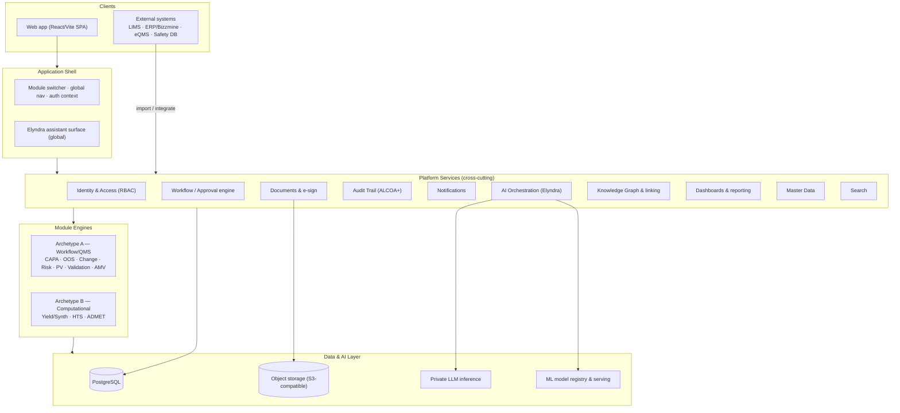
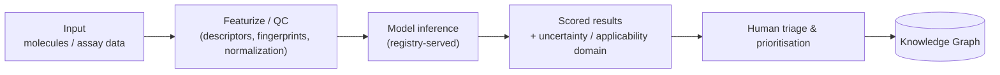
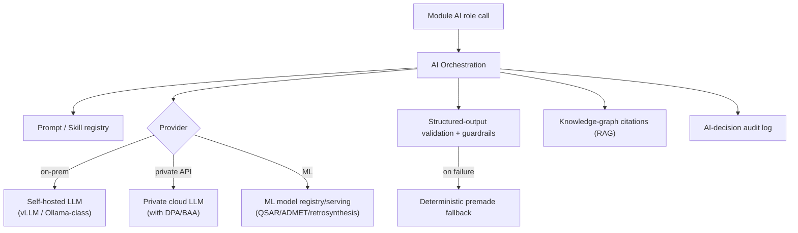
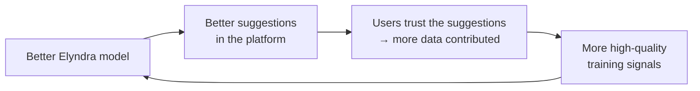
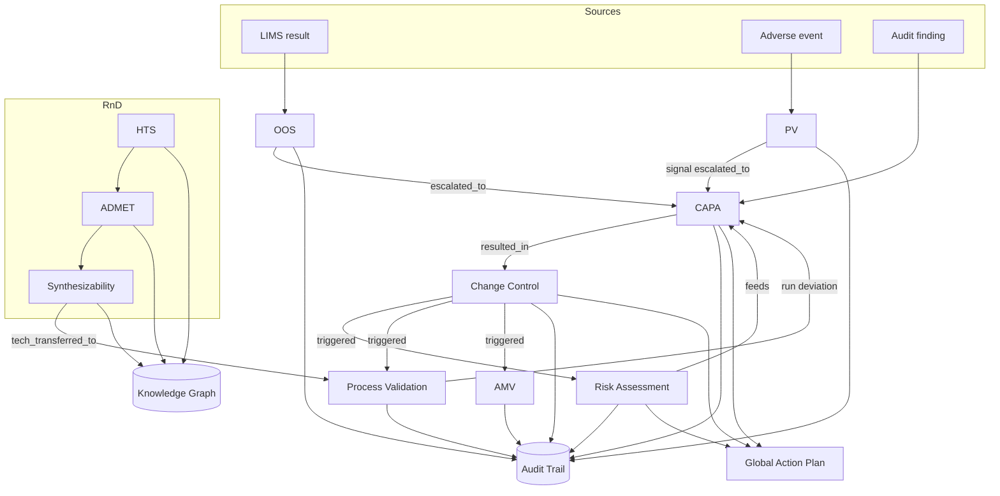
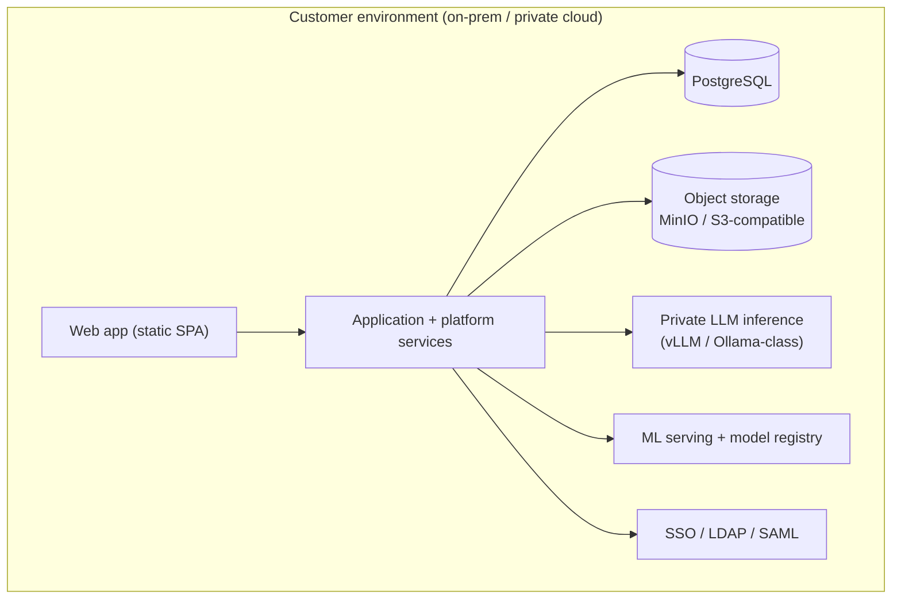

# Lead AI — Technical Specification

> **Status:** Forward-looking *target architecture*. This is not as-built documentation and contains no migration plan — it is a thinking aid for designing the whole system. Today only **CAPA** is built; it is used here purely as the **reference** for how a module works in practice.
>
> **Companion:** [`PRODUCT_SPEC.md`](PRODUCT_SPEC.md) covers the *what & why* (market, personas, modules). This document covers the *how*.

## How to use this document

A **living architecture anchor**. It captures the structural decisions that let one platform host ten very different modules without becoming ten silos. Future design discussions should start here.

- **§1–3** set the principles and the two-archetype framing.
- **§4–5** define the two per-module engines (Workflow vs. Computational).
- **§6–9** define the shared platform: services, AI, data model, and the workflow engine.
- **§10–11** show how modules connect and give a technical one-pager per module.
- **§12–14** cover compliance, on-prem deployment, and the recommended stack.
- **§15** parks the genuinely open decisions.

Reference implementation files are linked inline (e.g. [`server/src/workflows.ts`](server/src/workflows.ts)) — these are the *proven patterns* the target generalises, not files to preserve.

## Table of contents

1. [Architectural principles](#1-architectural-principles)
2. [System context & high-level architecture](#2-system-context--high-level-architecture)
3. [The two module archetypes](#3-the-two-module-archetypes)
4. [The Module Framework (Archetype A)](#4-the-module-framework-archetype-a)
5. [The Computational Framework (Archetype B)](#5-the-computational-framework-archetype-b)
6. [Platform services](#6-platform-services)
7. [AI architecture](#7-ai-architecture)
8. [Data model](#8-data-model)
9. [Workflow & approval engine](#9-workflow--approval-engine)
10. [Cross-module integration map](#10-cross-module-integration-map)
11. [Module technical blueprints](#11-module-technical-blueprints)
12. [Compliance & validation architecture](#12-compliance--validation-architecture)
13. [Deployment & infrastructure (on-prem)](#13-deployment--infrastructure-on-prem)
14. [Recommended tech stack](#14-recommended-tech-stack)
15. [Open technical questions](#15-open-technical-questions)

---

## 1. Architectural principles

1. **Platform-and-modules, not a monolith of features.** Cross-cutting concerns (identity, audit, notifications, documents, knowledge graph, AI, dashboards) are **platform services**; each module consumes them and never re-implements them.
2. **Config-driven workflows.** Approval cycles, stages, and gates are **declarative configuration**, not branching code. The reference already does this ([`server/src/workflows.ts`](server/src/workflows.ts)) and it generalises to every Archetype-A module.
3. **AI-native, human-in-the-loop.** AI drafts, classifies, and retrieves; **humans decide and sign**. AI output is always reviewer-editable and never treated as a system of record on its own.
4. **Compliance by design.** Immutable audit trail, e-signatures, and access control are foundational, not bolt-ons — built for 21 CFR Part 11 / EU Annex 11 / ALCOA+ from the start.
5. **On-prem first, data-residency aware.** The product deploys inside a customer's validated environment. **AI inference must be able to run on-prem/privately** because molecule and GMP data are sensitive IP.
6. **Two archetypes, one platform.** Workflow/QMS and Predictive/Computational modules have different engines but share the platform spine (§3).
7. **Type-discriminated records over rigid schemas.** Domain records are stored as typed JSON blobs with extracted scalar columns for query — fast to evolve, 1:1 with the typed frontend models (§8).
8. **The AI is the product; usage is the training data.** The platform is designed to continuously generate high-quality, labelled training data from real user interactions (accepted edits, rejected suggestions, successful case closures). This data fuels training of Elyndra — a **proprietary domain model** — which is the product's primary value and competitive moat (see §7.5–7.6).

---

## 2. System context & high-level architecture



**Reading it:** clients talk to a thin **shell** (module switcher + global nav + the Elyndra surface); the shell calls **platform services**; services drive the **module engines**; everything persists to a shared **data/AI layer**. AI orchestration fronts both private LLM inference (for Elyndra) and the ML model registry (for R&D).

---

## 3. The two module archetypes

| | **Archetype A — Workflow / QMS** | **Archetype B — Predictive / Computational** |
|---|---|---|
| **Unit of work** | A **case** advancing through governed stages | A **prediction job / experiment** over molecules & assays |
| **Engine** | Module Framework (§4) | Computational Framework (§5) |
| **Persistence** | Case records (JSON-blob + scalars) | Datasets, model runs, prediction results |
| **AI** | LLM (Elyndra): draft/classify/coach/retrieve | Domain ML: QSAR, graph nets, retrosynthesis |
| **Human action** | Investigate → decide → approve → sign | Design → run → interpret → prioritise |
| **Regulatory weight** | High (GMP, Part 11) | Lower in discovery; data integrity & IP |

**What they share (the platform spine):** identity, audit, notifications, documents, knowledge graph, dashboards, search, master data, and the Elyndra chat surface. A user moves between a CAPA investigation and an ADMET run inside the *same* shell, with the *same* login, audit trail, and assistant.

---

## 4. The Module Framework (Archetype A)

Every workflow/QMS module is an **instance** of one framework, generalised from the CAPA reference. CAPA = the framework with `CAPAType ∈ {deviation, audit, complaint}`; OOS, Change Control, etc. are new instances with their own types, stages, and gate questions.

### 4.1 The generalised Case
Derived from `CAPACase` ([`src/types/capa.ts`](src/types/capa.ts)). Every module case carries:

```ts
interface ModuleCase<TPrefill, TStep, TStatus, TSubtype> {
  id: string;
  module: ModuleKey;            // "capa" | "oos" | "change_control" | ...
  subtype: TSubtype;            // e.g. deviation | audit | complaint
  title: string;
  sourceRef?: { system: string; id: string };  // upstream finding/trigger
  prefill: TPrefill;            // type-discriminated intake context
  gateAnswers: GateAnswer[];    // intake quality gate
  score: QualityScore;          // multi-dimensional + "ready" threshold
  currentStep: TStep;           // module-specific stage machine
  status: TStatus;
  aiSuggestions: ElyndraSuggestion[];
  approvals: ApprovalEvent[];
  actions: ActionRef[];         // → Global Action Plan
  auditEvents: AuditEvent[];    // → platform Audit Trail
  owner: UserRef; assignee: UserRef; department: string;
  createdAt: ISO8601; updatedAt: ISO8601;
}
```

### 4.2 The five reusable mechanisms
1. **Intake (source → case).** A trigger from an upstream system produces a case with **type-discriminated pre-fill** and a set of **gate questions** that act as a quality gate. (CAPA: six gates — observation, scope, impact, containment, cause confirmation, effectiveness criteria.)
2. **Quality scoring.** A weighted, multi-dimensional score with a "ready"/"audit-ready" threshold, giving authors live feedback. Each module defines its own dimensions.
3. **Stage machine.** A module-specific ordered set of steps (CAPA's is the 8D: problem → containment → rca → ca → pa → verification → signoff). Stored as `currentStep`.
4. **AI roles.** A declared set of Elyndra tasks per module/step (draft, classify, coach, retrieve) — see §7.
5. **Governed approval.** A declarative workflow (§9) resolves who must sign, when, and under what conditions.

### 4.3 Adding a module = declaring, not coding
A new Archetype-A module is defined by a **module descriptor**:

```ts
interface ModuleDescriptor {
  key: ModuleKey;
  subtypes: string[];
  prefillSchemas: Record<string, ZodSchema>;   // per subtype
  gateQuestions: GateQuestionDef[];
  steps: StepDef[];                              // the stage machine
  scoreDimensions: ScoreDimensionDef[];
  aiRoles: AiRoleDef[];                          // §7 prompt/skill registry
  workflow: Record<string, WorkflowConfig>;      // §9, per subtype
}
```

The shell, list/detail pages, audit logging, notifications, and approval engine all operate generically off this descriptor — exactly as CAPA does today, just no longer hard-wired to one module.

---

## 5. The Computational Framework (Archetype B)

R&D modules need a fundamentally different engine: data and models, not cases and approvals.

### 5.1 Core entities
- **Dataset** — compound libraries, assay results, reaction data; versioned, with provenance.
- **Molecule / Entity** — canonical structure (SMILES/InChI), identifiers, computed descriptors; the node that the knowledge graph threads through to manufacturing.
- **Model** — a registered, versioned predictor (QSAR/ADMET/retrosynthesis) with metadata: training data ref, metrics, applicability domain.
- **Prediction job** — an inference run: inputs (molecules/assay), model version, parameters → results with **scores + uncertainty**.
- **Experiment / Campaign** — groups jobs and human decisions (e.g., an HTS campaign, a hit-triage round).

### 5.2 Flow


### 5.3 What it borrows from the platform
Datasets and reports use **Document Management**; molecules and results become **Knowledge Graph** nodes; campaigns raise **Notifications**; runs are recorded in the **Audit Trail** (data integrity / provenance); Elyndra provides a **natural-language layer** ("show me hits with hERG risk below X and good synthesizability"). The ML serving itself is its own subsystem (§7.4).

---

## 6. Platform services

| Service | Responsibility | Generalised from / notes |
|---|---|---|
| **Identity & Access (IAM)** | Authenticated users; **RBAC** roles scoped per site/department; the "act-as-persona" review model on top of real identities; on-prem **SSO/LDAP/SAML**. | Today: 5 fixed personas, no real auth. Target: real users + roles + permissions. |
| **Workflow / Approval engine** | Resolve and drive approval cycles from declarative config; e-signatures; state transitions. | §9; generalises [`server/src/workflows.ts`](server/src/workflows.ts). |
| **AI Orchestration (Elyndra)** | One entry point for all AI: prompt/skill registry, provider abstraction, structured output, fallback, citations, AI audit. | §7. |
| **Audit Trail** | Single append-only, immutable event log across all modules **and AI actions**; ALCOA+ / Part 11. | Generalises the existing `audit_events` design. |
| **Notifications** | Role-routed task/approval/overdue/escalation alerts; one cross-module inbox. | Exists for CAPA; promote to platform. |
| **Document & Evidence Mgmt** | Versioned object storage for attachments, protocols, reports, certificates; controlled documents; e-signature binding. | New (today files are mocked). |
| **Knowledge Graph & Linking** | Typed nodes (findings, cases, changes, risks, molecules, batches…) and edges (triggered, escalated-to, mitigates, derived-from); powers "similar cases," impact analysis, and lifecycle traceability. | Generalises today's similarity/citation feature. |
| **Dashboards & Reporting** | Cross-module KPIs, trends, scheduled/inspection reports, exports. | Exists for CAPA; make module-aware + aggregate. |
| **Master Data** | Canonical products, batches/lots, equipment, suppliers, methods, SOPs, sites — referenced by every module. | New shared registry. |
| **Search** | Global search over records, documents, and the graph. | New. |

---

## 7. AI architecture

The "Elyndra" layer, generalised. Reference patterns live in `server/src/ai.ts` and `src/services/nova/*` — note the reference codebase still uses the internal name `nova` in its identifiers (`NovaSuggestion`, `novaMetadata`, etc.); the product brand is **Elyndra**.

### 7.1 Provider abstraction
A single interface fronts multiple backends so deployments choose what fits their data-residency posture:



### 7.2 LLM tasks (Archetype A)
- **Skill/prompt registry.** Each module/step declares its AI roles (draft gate answers, classify severity, generate next "why", suggest actions, coach verification, chat). Prompts are versioned artifacts, not inline strings.
- **Structured output + validation.** Calls request JSON and validate against a schema (the reference uses Zod / loose-JSON parsing); invalid output is rejected.
- **Deterministic fallback.** If inference is unavailable or invalid, a curated premade response is served so the workflow never breaks — a core reliability property already in the reference.
- **RAG / citations.** Suggestions cite similar historical cases from the **knowledge graph** (the reference's `KGCitation` with similarity score, root cause, outcome).
- **Guardrails.** System prompt enforces *reviewer-editable drafts, never invent facts* (no fabricated batch IDs, SOPs, dates, people, citations). This is non-negotiable for GMP.

### 7.3 AI as an audited actor
Every AI action is attributed in the Audit Trail with model name/version and a confidence score (the reference's `novaMetadata`), and every suggestion tracks **accept / edit / replace** so reviewers' overrides are recorded — essential for Part 11 defensibility.

### 7.4 ML serving (Archetype B)
- **Model registry** — versioned models with training-data lineage, validation metrics, and **applicability domain**.
- **Inference service** — batch/async prediction jobs over molecules/datasets; returns scores **with uncertainty**.
- **Provenance** — every prediction records model version + inputs, so a result is reproducible and auditable.

### 7.5 Proprietary model training pipeline

Elyndra is not a call to an external LLM. **Elyndra is a proprietary domain model, built in-house from scratch** — trained specifically on pharmaceutical QMS and drug discovery data, and **deployed as a backend service** inside the customer environment. The platform itself is the primary data factory for that training. (This is a confirmed product decision; how "from scratch" is realised — full pretraining vs. heavy fine-tuning of an open base — is a technical detail deferred to later, see §15.)

```mermaid
flowchart LR
    subgraph Platform["Production platform (data factory)"]
        USAGE["User interactions<br/>(accept · edit · replace)"]
        CASES["Closed cases<br/>(CAPA · OOS · Change · etc.)"]
        EXPERT["Expert corrections<br/>(reviewer overrides)"]
    end
    subgraph Pipeline["Training pipeline"]
        EXTRACT["Extraction & labelling<br/>(interaction signals → labelled examples)"]
        FILTER["Quality filtering<br/>(remove low-signal / PII)"]
        CURATE["Curation & augmentation<br/>(domain-expert review)"]
        TRAIN["Fine-tuning / training run<br/>(base model + domain data)"]
        EVAL["Evaluation<br/>(GMP accuracy · GxP-specific benchmarks)"]
    end
    subgraph Deploy["Elyndra release"]
        VAL["Model validation<br/>(GxP/CSV — see §12)"]
        REG["Model registry<br/>(versioned + frozen for inspection)"]
        INF["On-prem inference<br/>(served within customer environment)"]
    end
    Platform --> EXTRACT --> FILTER --> CURATE --> TRAIN --> EVAL --> VAL --> REG --> INF
    INF -->|better suggestions| Platform
```



**Training signal types:**

| Signal | What it captures | Label |
|---|---|---|
| User **accepts** a Elyndra suggestion verbatim | The output was correct and useful | Positive |
| User **edits** a suggestion before accepting | What the correct answer looks like | Correction |
| User **replaces** a suggestion entirely | The suggestion was wrong or unhelpful | Negative + correct target |
| A case is **closed** and deemed effective | Full investigation workflow as a positive example | Trajectory |
| A reviewer **requests revision** | The intake quality was insufficient | Negative signal on intake draft |

**Training data strategy:**
- All signals are extracted from the **Audit Trail** — which already records accept/edit/replace and every workflow state change (§7.3). No separate instrumentation needed; the compliance log is also the training log.
- Data is **de-identified and sanitised** before leaving a customer environment for any central training run. Customers with strict data-residency requirements can contribute signals in privacy-preserving form (aggregated gradient updates, federated learning) or train on their own data silo only.
- **Domain expert curation** is a scheduled step before every major training run — a small set of reviewed, high-confidence examples prevents model drift.

**What the training produces:**
- A **Elyndra LLM** (Archetype A) fine-tuned on pharma GMP investigation data: deviation RCA, gate-question drafting, corrective-action wording, MedDRA coding, audit narratives.
- Proprietary **QSAR/ADMET/retrosynthesis models** (Archetype B) trained on the platform's accumulated molecular and assay data.

### 7.6 The data flywheel

The mechanism that makes the proprietary model defensible over time:



Each customer deployment that uses the platform generates training data. A better model makes the platform more useful, which increases usage, which generates more training data, which produces a better model. General-purpose LLMs cannot participate in this loop — they improve along a different axis entirely.

**The implication for software design:** every feature should be built with the question *"does this generate a useful training signal?"* in mind. Structured accept/edit/replace flows are not just good UX — they are the training data interface. Every place where Elyndra makes a suggestion and a human overrides it is a labelled training example.

---

## 8. Data model

### 8.1 Storage convention (carried from the reference)
Domain records use **JSON-blob + extracted scalar columns**: the full typed object lives in a `data` JSON column (1:1 with the frontend type), with a few scalar columns pulled out for filtering/sorting/indexing ([`server/src/db.ts`](server/src/db.ts)). This keeps records fast to evolve and avoids wide migrations as module shapes change.

```sql
-- Pattern for every Archetype-A module case table:
CREATE TABLE <module>_cases (
  id           TEXT PRIMARY KEY,
  module       TEXT NOT NULL,
  subtype      TEXT,
  status       TEXT,
  current_step TEXT,
  department   TEXT,
  assignee     TEXT,
  source_ref   TEXT,
  created_at   TEXT,
  updated_at   TEXT,
  data         JSONB NOT NULL          -- full typed record
);
```

**When to normalize instead:** master data (products, batches, equipment, suppliers), cross-module **link edges**, user/role tables, and analytics roll-ups are proper relational tables — they are queried relationally and shared across modules. JSON-blob is for the *case body*; relations are for the *connections and shared entities*.

### 8.2 Shared entities (ER overview)
```mermaid
erDiagram
    USER ||--o{ ROLE_ASSIGNMENT : has
    ROLE ||--o{ ROLE_ASSIGNMENT : grants
    SITE ||--o{ DEPARTMENT : contains
    PRODUCT ||--o{ BATCH : has
    MODULE_CASE ||--o{ ACTION : raises
    MODULE_CASE ||--o{ APPROVAL : requires
    MODULE_CASE ||--o{ AUDIT_EVENT : logs
    MODULE_CASE ||--o{ DOCUMENT : attaches
    KG_NODE ||--o{ KG_EDGE : from
    KG_NODE ||--o{ KG_EDGE : to
    MODULE_CASE ||--|| KG_NODE : projected_as
    MOLECULE ||--|| KG_NODE : projected_as
    PREDICTION_JOB ||--o{ PREDICTION_RESULT : produces
    MODEL ||--o{ PREDICTION_JOB : serves
```

- **Identity:** `USER`, `ROLE`, `ROLE_ASSIGNMENT` (scoped by `SITE`/`DEPARTMENT`).
- **Master data:** `PRODUCT`, `BATCH`, `EQUIPMENT`, `SUPPLIER`, `METHOD`, `SOP`.
- **Module spine:** `MODULE_CASE` (per-module tables), `ACTION`, `APPROVAL`, `AUDIT_EVENT`, `NOTIFICATION`, `DOCUMENT`.
- **Knowledge graph:** `KG_NODE` + `KG_EDGE` — cases, molecules, batches, etc. are *projected* as nodes; edges carry typed relationships.
- **Computational:** `MOLECULE`, `DATASET`, `MODEL`, `PREDICTION_JOB`, `PREDICTION_RESULT`.

### 8.3 Cross-module links
A single typed edge table is the backbone of §10:

| from_type | edge | to_type | example |
|---|---|---|---|
| oos_case | escalated_to | capa_case | confirmed OOS → CAPA |
| capa_case | resulted_in | change_control | corrective action = a change |
| change_control | triggered | risk_assessment / process_validation / amv | impact follow-ups |
| risk_assessment | feeds | capa_case / change_control | mitigation as action |
| pv_signal | escalated_to | capa_case / risk_assessment | safety signal |
| molecule | derived_from | hts_hit / admet_profile | discovery lineage |
| molecule | tech_transferred_to | process_validation | R&D → Manufacturing |

---

## 9. Workflow & approval engine

Generalised directly from the reference [`server/src/workflows.ts`](server/src/workflows.ts), which is already a declarative cycle engine.

### 9.1 Declarative cycle model
```ts
interface WorkflowConfig {
  subtype: string;                 // e.g. "deviation"
  intake?: { gate?: boolean; disposition?: boolean; scheduleContext?: boolean };
  twoPhase?: boolean;
  cycles: ApprovalCycleDef[];
  loops?: { customerResponse?: boolean; closingCompleteness?: boolean; reportBack?: boolean };
}

interface ApprovalCycleDef {
  stage: string;                   // plan | actual | analysis | closure | signoff | ...
  base: RoleKey[];                 // approvers always required
  gated?: GatedApprover[];         // conditionally inserted approvers
  attachAfter: StepKey;            // which stage-machine step this cycle follows
  final?: boolean;
}

interface GatedApprover {
  role: RoleKey;
  when: (c: ModuleCase) => boolean;   // e.g. severity ∈ {Major, Critical}
  insertBeforeLast?: boolean;
}
```

### 9.2 Capabilities (already proven on CAPA)
- **Base + conditionally-gated approvers** — e.g. SME co-approval auto-inserted for Major/Critical deviations.
- **Two-phase cycles** — Plan → Actual → Closure (audit CAPAs).
- **Multi-round loops** — customer-response / closing-completeness (complaint CAPAs).
- **Role resolution** — `resolveCycleApprovers(cycle, case)` builds the ordered chain by evaluating gates.
- **Final-stage detection** drives closure.

### 9.3 What the target adds
- **Real e-signatures** bound to authenticated identity + reason (Part 11), replacing persona stand-ins.
- **Per-deployment configurability** — a customer's QA can tune cycles/roles without code.
- **Engine is module-agnostic** — it reads a `WorkflowConfig`, so OOS, Change Control, Risk, etc. declare their own cycles and reuse the same engine.

---

## 10. Cross-module integration map

The technical realisation of the [`PRODUCT_SPEC.md` §10](PRODUCT_SPEC.md#10-cross-module-workflows--the-molecule-lifecycle) product narrative: modules emit **typed events** that the platform turns into **cross-module links + actions + notifications**, all sharing one audit trail.



**Mechanism:** a module raises a domain event (e.g. `oos.confirmed`); a lightweight **integration layer** creates the target case (or proposes it for human confirmation), writes a `KG_EDGE`, and notifies the owner. Every link is queryable, so impact analysis ("what did this change touch?") and lifecycle traceability ("trace this batch issue back to its discovery-era route") are first-class.

---

## 11. Module technical blueprints

One technical one-pager per not-yet-built module: **records · stage machine or model flow · AI roles · key integrations.** (CAPA is the worked reference in §4 and [`PRODUCT_SPEC.md` §8](PRODUCT_SPEC.md#8-capa--the-reference-module-in-depth).)

### Archetype A (Module Framework instances)

**OOS / OOT** — *Records:* investigation case (subtype: oos | oot), tested sample, hypotheses, phase data. *Stages:* `phase1_lab → hypothesis_test → phase2_full → disposition → escalation`. *AI:* cause classification, Phase-I checklist draft, trend/OOT detection, precedent retrieval. *Integrations:* ← LIMS; **→ CAPA** (`escalated_to`); ↔ AMV; → batch disposition.

**Change Control** — *Records:* change request, impact/risk assessment, classification, implementation plan. *Stages:* `request → impact_assessment → classification → review_approval → implementation → closure`. *AI:* change/risk classification, impacted-entity discovery, impact-assessment draft, follow-up recommendation. *Integrations:* ← CAPA (`resulted_in`); **→ Risk / Process Validation / AMV** (`triggered`); → Document Mgmt (controlled docs); → Action Plan.

**Risk Assessment** — *Records:* assessment (scope/question), hazards, FMEA scoring (S×O×D→RPN), mitigations. *Stages:* `scope → identify → analyze_score → evaluate → control → review`. *AI:* hazard/failure-mode suggestion, S/O/D estimation from history, RPN recompute, mitigation draft. *Integrations:* **feeds CAPA / Change Control / Process Validation**; periodic-review scheduler.

**Process Validation** — *Records:* protocol, qualification runs/batches + captured data, statistical analysis (Cpk/Ppk), report, CPV plan. *Stages (lifecycle):* `stage1_design → stage2_PPQ → stage3_CPV`; each protocol `authored → approved → executed → analyzed → reported → approved`. *AI:* protocol drafting, capability/statistical analysis, CPV trend monitoring, report drafting, revalidation triggers. *Integrations:* ← Change Control; uses Risk; run deviations → CAPA; CPV trend → OOT.

**AMV** — *Records:* method-development (DoE) record, validation protocol, characteristic data (accuracy, precision, specificity, LOD/LOQ, linearity, range, robustness), report. *Stages:* `develop → protocol → execute → assess_vs_ICHQ2 → report → transfer`. *AI:* DoE suggestion, parameter evaluation vs. criteria, robustness prediction, protocol/report drafting. *Integrations:* ← Change Control / Process Validation; supports OOS; → QC/LIMS transfer.

**Pharmacovigilance** — *Records:* ICSR, MedDRA-coded events, causality/seriousness assessments, aggregate signals, periodic reports. *Stages:* `intake → triage → coding → causality → medical_review → submission`; plus an aggregate **signal-detection** pipeline. *AI:* narrative extraction, MedDRA coding suggestion, seriousness/expectedness classification, duplicate detection, statistical signal detection, narrative drafting. *Integrations:* signals **→ CAPA / Risk**; ↔ complaints. *Note:* case-management is Archetype A; signal detection is an analytical sub-pipeline.

### Archetype B (Computational Framework instances)

**Yield / Synthesizability** — *Entities:* target molecule, candidate routes, route scores. *Model flow:* molecule → retrosynthesis → candidate routes → yield/feasibility scoring → ranked routes. *Models:* retrosynthesis (template/transformer), yield regression, synthetic-accessibility scoring. *Integrations:* consumes HTS/ADMET priorities; **→ tech transfer** (`tech_transferred_to` Process Validation).

**High-Throughput Screening** — *Entities:* assay dataset (plates), compounds, hits, dose-response curves. *Model flow:* ingest → QC (Z′-factor) → hit calling → curve fitting (IC50/EC50) → triage. *Models:* virtual screening/hit prediction, PAINS/artifact detection, active learning, QSAR. *Integrations:* hits **→ ADMET / Synthesizability**; data → KG.

**ADMET Prediction** — *Entities:* molecule, descriptor set, per-property predictions, risk profile. *Model flow:* molecule → featurize → battery of property models (solubility, Caco-2, CYP, hERG, hepatotox, Ames…) → profile + flags → ranking. *Models:* suite of QSAR/QSPR (graph nets/ensembles) with uncertainty + applicability domain. *Integrations:* drives candidate selection; feeds Synthesizability; → KG molecule record.

---

## 12. Compliance & validation architecture

The product targets validated GMP environments, so compliance is structural.

| Concern | Design response |
|---|---|
| **21 CFR Part 11 / EU Annex 11** | Immutable audit trail; authenticated **e-signatures** bound to identity + reason + timestamp; enforced access control; record integrity. |
| **ALCOA+ data integrity** | Every record/event is Attributable, Legible, Contemporaneous, Original, Accurate (+ Complete, Consistent, Enduring, Available). The audit trail captures actor (incl. **Elyndra** as AI actor), before/after, and timestamp. |
| **GAMP 5** | Software categorised; configuration (workflows, gates, roles) separated from code so customer-specific config doesn't invalidate validation; risk-based validation. |
| **IQ/OQ/PQ & CSV** | Deployment supports installation/operational/performance qualification; environment config is explicit and version-pinned (§13) for repeatable validated installs. |
| **BPOM / CPOB** (Indonesia) first; **FDA/EMA** later | **Indonesia is the v1 target.** Templates, terminology, and report formats are configurable per regulatory framework so additional regulators (FDA, EMA) can be added without re-architecting — a confirmed product decision ([`PRODUCT_SPEC.md` §12](PRODUCT_SPEC.md#12-open-product-questions)). |
| **AI defensibility** | AI is advisory and audited (§7.3); humans sign; suggestions record accept/edit/replace; models (Archetype B) carry version + applicability domain for reproducibility. |

---

## 13. Deployment & infrastructure (on-prem)

Single-customer, deployed inside the customer's validated environment.



- **Packaging:** containerised (Docker / Compose or Kubernetes) for repeatable, validatable installs; version-pinned images.
- **Database:** PostgreSQL (the reference's SQLite JSON-blob design ports directly to `JSONB`).
- **Object storage:** S3-compatible (MinIO on-prem) for documents/evidence.
- **AI:** **private LLM inference on-prem** by default for data residency; the provider abstraction (§7.1) allows a private-cloud LLM with a data-processing agreement where the customer permits.
- **Identity:** integrate the customer's SSO/LDAP/SAML.
- **Backup/DR, observability:** standard backup of Postgres + object store; structured logs/metrics; all within the customer's perimeter.

---

## 14. Recommended tech stack

Reuse the proven choices from the reference where they hold up; add what production/on-prem demands.

| Layer | Recommendation | Rationale |
|---|---|---|
| **Frontend** | Keep **React + TypeScript + Vite**, **shadcn/ui + Tailwind**, **React Query**, **Zustand**. | Proven in the reference; fast, themeable, component-rich. Add a **module-switcher shell** + generic list/detail driven by the module descriptor (§4.3). |
| **Backend / API** | TypeScript service (evolve the existing Express service) exposing a typed REST (or tRPC) API; the workflow engine, IAM, AI orchestration, and audit as internal services. | Keeps one language end-to-end; the reference's repo/logic/workflow split already points this way. |
| **Database** | **PostgreSQL** with `JSONB` case bodies + relational master/link tables; recursive queries (or a graph extension) for the knowledge graph. | Direct port of the reference design; production-grade, on-prem friendly. |
| **Object storage** | S3-compatible (MinIO on-prem). | Documents/evidence with versioning. |
| **AI — Elyndra (LLM, Archetype A)** | **Proprietary model, built in-house from scratch**, deployed as a backend service on-prem; versioned prompt/skill registry; structured-output validation + deterministic fallback. | The model *is* the product — not a wrapper over a generic LLM. Data residency + reliability pattern already proven in reference. |
| **AI — Training pipeline** | Python ML stack (PyTorch / HuggingFace Transformers) for fine-tuning; training-data extraction from the Audit Trail; quality filtering + curation tooling; GxP model evaluation harness. | §7.5; the Audit Trail doubles as the training data pipeline. |
| **AI — ML (R&D, Archetype B)** | Proprietary QSAR/ADMET/retrosynthesis models trained on accumulated molecular + assay data; cheminformatics toolkit (RDKit) for featurization; model registry + inference service. | Archetype B models follow the same train-on-own-data strategy as Elyndra. |
| **Auth** | Real IAM with RBAC + SSO/LDAP/SAML; e-signature service. | Replaces persona-only model for Part 11. |

---

## 15. Open technical questions

> **Note:** The user is currently focused on wireframes and product flow; most architecture decisions are intentionally deferred. These are anchors for later, not blockers now.

**Confirmed:** AI/ML is **built in-house from scratch** and **deployed as backend services** (Elyndra LLM + R&D QSAR/ADMET/retrosynthesis models). **Regulatory:** Indonesia (BPOM/CPOB) first, with other frameworks pluggable.

1. **"From scratch" realisation** — full pretraining of a domain LLM vs. heavy fine-tuning of an open base. Affects compute, timeline, and licensing, but not the product positioning (the model is proprietary either way).
2. **Training data bootstrap** — before enough production interactions exist, what curated seed dataset (synthetic CAPA cases, regulatory/ICH texts, the `lead-ai-platform/` pipeline docs) seeds the first Elyndra model?
3. **Customer data contribution model** — full sharing, privacy-preserving federated signals, or silo-per-customer? Depends on contractual + regulatory constraints per on-prem deployment.
4. **Backend-service boundary** — how the AI/ML services are split (one inference gateway vs. per-model services) and how they integrate with the application backend.
3. **Knowledge-graph store** — Postgres recursive/`ltree`/`AGE` extension vs. a dedicated graph database, given on-prem simplicity goals.
4. **Normalize vs. JSON-blob boundary** — confirm exactly which fields graduate to relational columns per module as query patterns emerge.
5. **API style** — REST vs. tRPC vs. GraphQL for the module-generic surface.
6. **Backend evolution** — keep a single TypeScript service, or split platform services from module engines as the system grows.
7. **External-system integration depth** — real-time connectors (LIMS, ERP/Bizzmine, eQMS, safety DB) vs. file/manual import, per customer.
8. **Validation strategy** — how configuration-vs-code separation (GAMP 5) is enforced so customer config changes don't trigger full revalidation.
